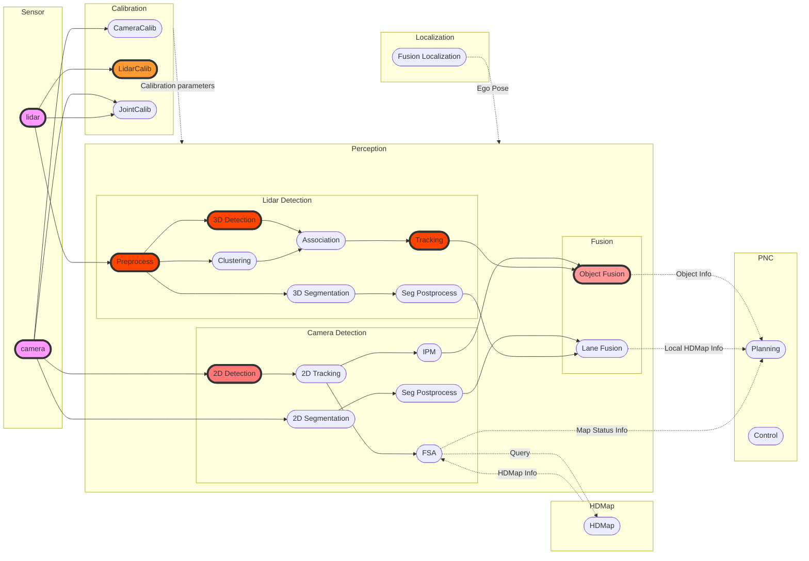

# Version 1.0

```mermaid
flowchart LR
    subgraph sensor [Sensor]
        camera([camera])
        lidar([lidar])
    end
    classDef Sensorclass fill:#f9f,stroke:#333,stroke-width:4px;
    class camera,lidar Sensorclass;
      
    subgraph calibration [Calibration]
        cam_calib([CameraCalib])
        lidar_calib([LidarCalib])
        joint_calib([JointCalib])
    end
    classDef Calibclass fill:#f93,stroke:#333,stroke-width:4px;
    class lidar_calib Calibclass;
  
    subgraph hdmap [HDMap]
        customize_hdmap([HDMap])
    end

    subgraph localization [Localization]
        fusion_localization([Fusion Localization])
    end

    subgraph pnc [PNC]
        planning([Planning])
        control([Control])
    end

    subgraph perception [Perception]
        subgraph lidar_detection [Lidar Detection]
            lidar_pp([Preprocess])
            lidar_3d_det([3D Detection])
            lidar_3d_cluster([Clustering])
            lidar_association([Association])
            lidar_3d_track([Tracking])
            lidar_3d_seg([3D Segmentation])
            lidar_3d_seg_postprocess([Seg Postprocess])

            lidar_pp-->lidar_3d_det
            lidar_pp-->lidar_3d_cluster
            lidar_pp-->lidar_3d_seg
            lidar_3d_det-->lidar_association
            lidar_3d_cluster-->lidar_association
            lidar_association-->lidar_3d_track
            lidar_3d_seg-->lidar_3d_seg_postprocess
        end
        classDef LidarDetclass fill:#f40,stroke:#333,stroke-width:4px;
        class lidar_pp,lidar_3d_det,lidar_3d_track LidarDetclass;
      
        subgraph camera_detection [Camera Detection]
            cam_2d_det([2D Detection])
            cam_2d_track([2D Tracking])
            cam_ipm([IPM])
            cam_2d_seg([2D Segmentation])
            cam_2d_seg_postprocess([Seg Postprocess])
            cam_fsa([FSA])

            cam_2d_det-->cam_2d_track
            cam_2d_track-->cam_ipm
            cam_2d_track-->cam_fsa
            cam_2d_seg-->cam_2d_seg_postprocess
        end
        classDef CamDetclass fill:#f77,stroke:#333,stroke-width:4px;
        class cam_2d_det CamDetclass;
          
        subgraph fusion [Fusion]
            object_fusion([Object Fusion])
            lane_fusion([Lane Fusion])
        end
        classDef Fusionclass fill:#f99,stroke:#333,stroke-width:4px;
        class object_fusion Fusionclass;
    end
      
    camera-->cam_calib
    camera-->joint_calib
    lidar-->lidar_calib
    lidar-->joint_calib
    lidar-->lidar_pp
    camera-->cam_2d_det
    camera-->cam_2d_seg
      
    cam_ipm-->object_fusion
    lidar_3d_track-->object_fusion

    cam_2d_seg_postprocess-->lane_fusion
    lidar_3d_seg_postprocess-->lane_fusion
      
    calibration-. Calibration parameters .-> perception
    fusion_localization -. Ego Pose .-> perception

    cam_fsa -. Query .-> customize_hdmap
    hdmap -. HDMap Info .-> cam_fsa

    object_fusion -. Object Info .-> planning
    lane_fusion -. Local HDMap Info .-> planning
    cam_fsa -. Map Status Info .-> planning

```
