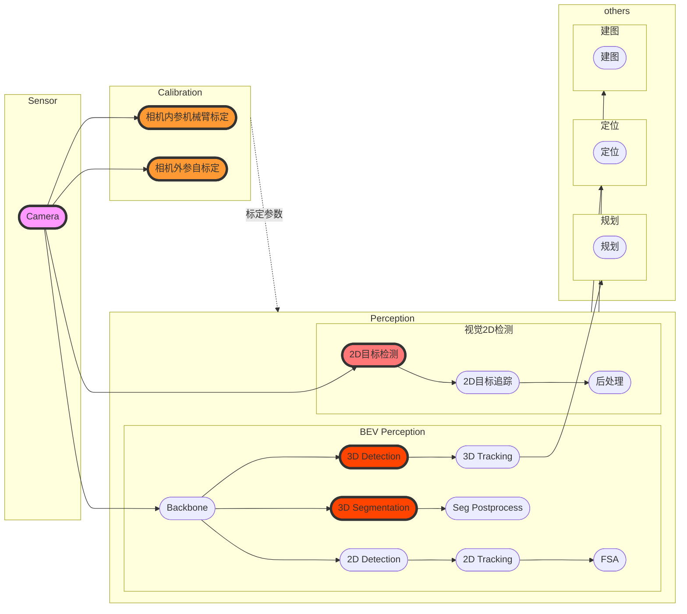

# Version 2.0

```mermaid
flowchart LR
    subgraph sensor [Sensor]
        camera([Camera])
    end
    classDef Sensorclass fill:#f9f,stroke:#333,stroke-width:4px;
    class camera Sensorclass;
    
    subgraph calibration [Calibration]
        cam_calib([相机内参机械臂标定])
        cam_auto_calib([相机外参自标定])
    end
    classDef Calibclass fill:#f93,stroke:#333,stroke-width:4px;
    class cam_calib,cam_auto_calib Calibclass;
  

      subgraph perception [Perception]
          subgraph bev_det [BEV Perception]
            backbone([Backbone])
            bev_3d_det_head([3D Detection])
            3d_track([3D Tracking])
            bev_3d_seg_head([3D Segmentation])
            3d_seg_postprocess([Seg Postprocess])

            2d_det_head([2D Detection])
            2d_track([2D Tracking])
            fsa([FSA])

            backbone-->bev_3d_det_head
            backbone-->bev_3d_seg_head
            bev_3d_det_head-->3d_track
            bev_3d_seg_head-->3d_seg_postprocess

            backbone-->2d_det_head
            2d_det_head-->2d_track
            2d_track-->fsa

          end
          classDef BEVclass fill:#f40,stroke:#333,stroke-width:4px;
          class bev_backbone,bev_3d_det_head,bev_3d_seg_head BEVclass;
      
          subgraph cam_det [视觉2D检测]
            cam_2d_det([2D目标检测])
            cam_2d_track([2D目标追踪])
            cam_2d_postprocess([后处理])
            cam_2d_det-->cam_2d_track
            cam_2d_track-->cam_2d_postprocess
          end
          classDef CamDetclass fill:#f77,stroke:#333,stroke-width:4px;
          class cam_2d_det CamDetclass;

      end
      
      subgraph others [others]
          subgraph planning [规划]
            planning_node([规划])
          end
          subgraph localization [定位]
            localization_node([定位])
          end
          subgraph mapping [建图]
            mapping_node([建图])
          end
      end
      
      camera-->cam_calib
      camera-->cam_auto_calib
      
      camera-->backbone
      camera-->cam_2d_det

      3d_track-->planning
      perception-->localization
      perception-->mapping
      
      
      calibration-. 标定参数 .-> perception
```
